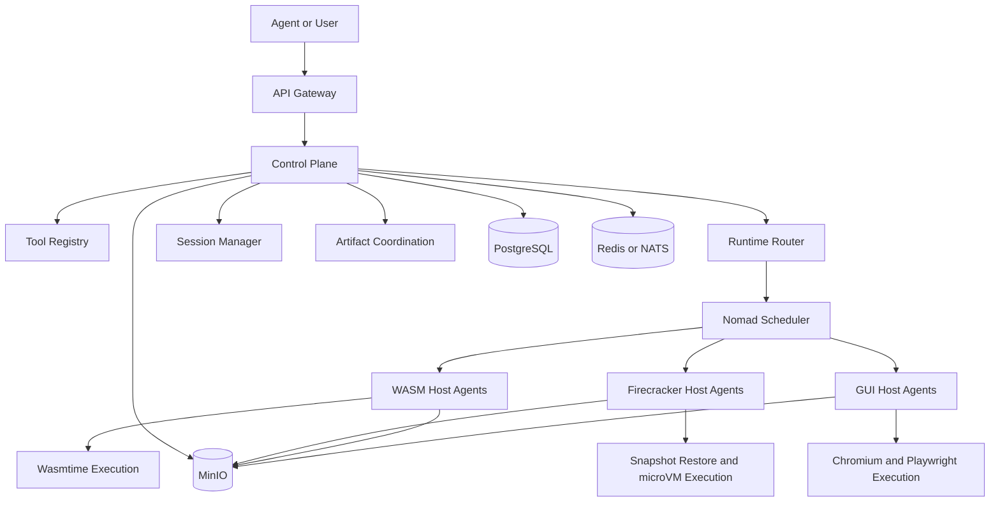
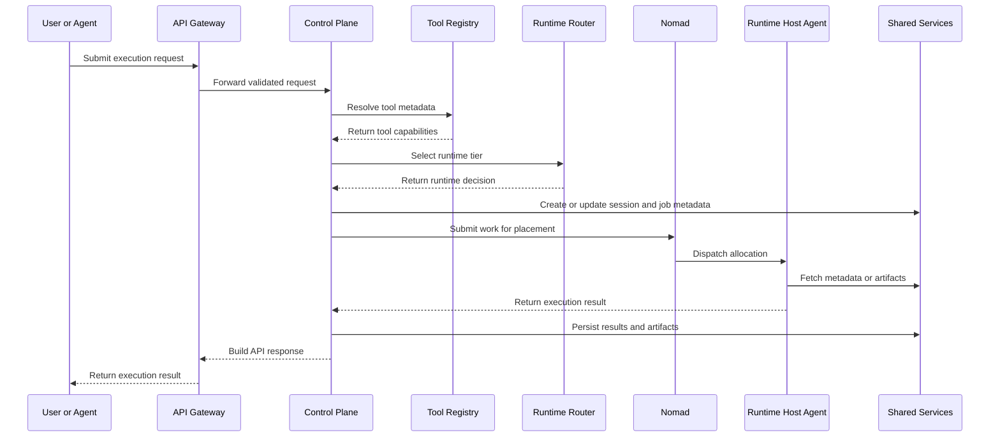

# System Overview

| Field | Value |
|---|---|
| Status | Active |
| Audience | Contributors, reviewers, operators |
| Scope | Main system diagram, components, and end-to-end request lifecycle |
| Last updated | March 11, 2026 |

## Executive summary

The platform separates business logic from workload placement. The control plane owns routing, policy, session lifecycle, and artifact coordination. Nomad places work onto runtime-specific host agents, which execute tools through WASM, Firecracker, or GUI environments.

## Main system diagram

## Primary components

| Component | Responsibility |
|---|---|
| API gateway | External request entry point, authentication boundary, and request handling |
| Control plane | Routing, policy, session lifecycle, tool selection, artifact coordination |
| Tool registry | Tool discovery, metadata, health state, and runtime fit |
| Runtime router | Chooses the correct runtime tier for a request |
| Nomad | Placement, scheduling, and lifecycle orchestration |
| WASM host agents | Execute small bounded workloads via Wasmtime |
| Firecracker host agents | Launch and manage secure microVM-based execution |
| GUI host agents | Run browser automation and visual workflows |
| PostgreSQL | Session and execution metadata |
| Redis or NATS | Queueing and coordination |
| MinIO | Artifact, module, and snapshot storage |

## End-to-end request lifecycle

### Sequence diagram

1. A user or upstream agent submits a request to the API gateway.
2. The control plane authenticates the request and creates or resolves a session.
3. The tool registry and runtime router determine the correct tool and runtime tier.
4. The request is placed onto the appropriate queue and scheduled through Nomad.
5. A runtime host agent receives the work and prepares the execution environment.
6. The selected runtime executes the tool.
7. Results, logs, and artifacts are persisted outside the sandbox lifecycle.
8. The control plane returns the execution result to the caller.

## Deployment model

The current MVP deployment model assumes three nodes:

| Node | Role | Current responsibilities |
|---|---|---|
| `node1` | Control node | API gateway, control plane, tool registry, PostgreSQL, Redis, MinIO, Nomad server |
| `node2` | Runtime node | WASM execution and Firecracker execution |
| `node3` | Runtime node | Firecracker execution and GUI execution |

Day-to-day engineering still validates this architecture primarily through a local sandbox before full production hardening.

## Architectural constraints

- business logic stays in the control plane
- Nomad is used for placement, not platform-specific workflow logic
- runtime isolation differs by execution tier
- execution artifacts must survive beyond sandbox teardown
- network and filesystem isolation are required for secure runtime maturity

## Related documents

- [../overview/platform-overview.md](../overview/platform-overview.md)
- [../reference/runtime-reference.md](../reference/runtime-reference.md)
- [../reference/tools-reference.md](../reference/tools-reference.md)
- [../reference/api-spec.md](../reference/api-spec.md)
- [../how-to/deploy.md](../how-to/deploy.md)
- [../operations/roadmap.md](../operations/roadmap.md)
